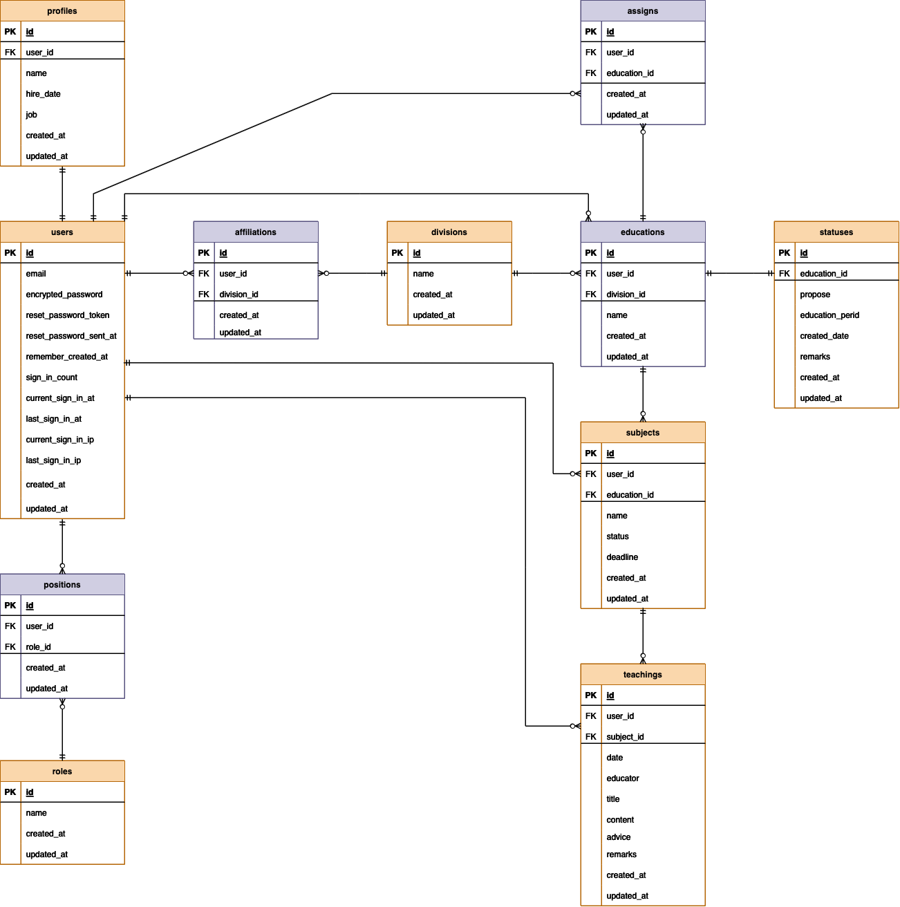
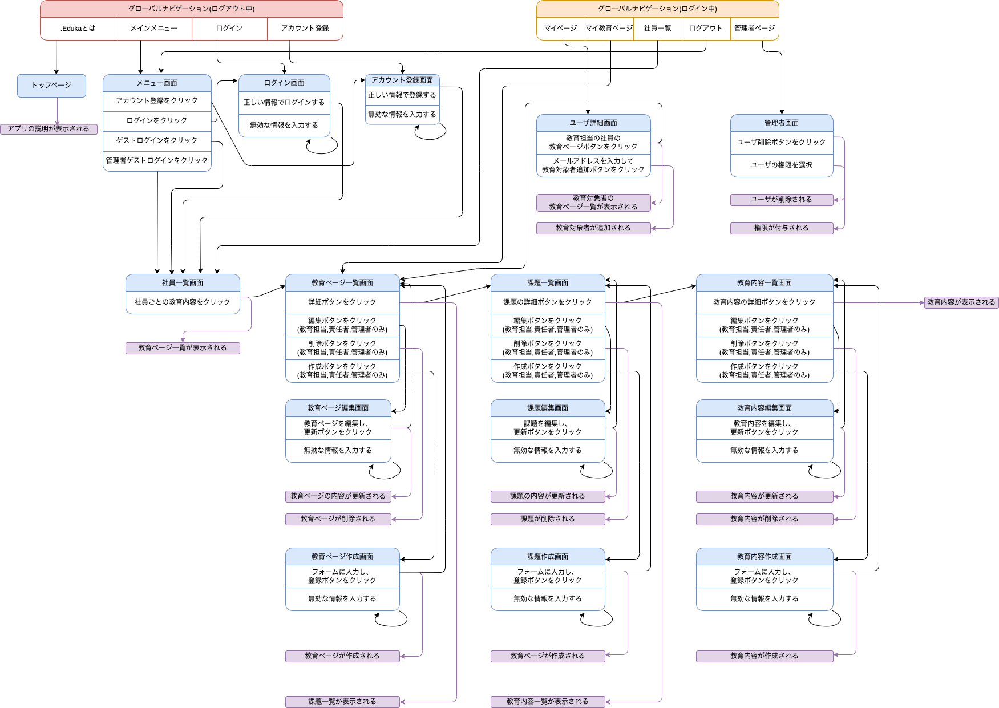

# README

## アプリ概要
- アプリ名:.Educa (Find real education)
<br>
「.Eduka」【開発の背景】										
<br>
皆さんはこのような経験はありませんか？
<br>
「１つの業務を教わるときに『先輩Aと先輩Bに違う方法』で教わり混乱した」
「自分以外の人がどのような指導を受けたのか『共有』できたらいいのに」
「手書きの小さなメモだと後で読み返した時に『情報が少なすぎる』」
「教育の『引き継ぎがうまくいかず教えづらい』」
「わたしだけが教育していて大変」
<br>
上記の例は私が美容師として働いていた、時に身をもって経験したことです。
<br>
.Edukaは「なんとなくの教育」を『可視化し共有する』ことで、
<br>
「新入社員の成長スピードが速くなる」
「社員の生産性が上がることで会社全体の売り上げが上がる」
「教育を引き継げるようにすることで、社員一人に負担がかかりすぎない」
「教育や技術が共有されることで、会社全体の技術•仕事レベルが上がっていく」
<br>
といった成果を目指すアプリケーションとなっています。

## 開発言語
- Ruby 3.0.1
- Rails 6.1.7

## 就職Termの技術
- gem/devise
- AWS EC2

## カリキュラム外の技術
- gem/rails_admin
- gem/cancancan
- gem/ransack

## 実行手順
````
$ git clone git@github.com:rikiya-miyazawa/Eduka_app.git
$ cd Eduka_app
$ bundle install
$ rails db:create && rails db:migrate
$ rails s
````

## チェックシート
https://docs.google.com/spreadsheets/d/16YcQeQXrJ_YFsqyhO2hmL86sBrpFL-lw9gQpDtunlJE/edit?usp=sharing
## カタログ設計
https://docs.google.com/spreadsheets/d/16YcQeQXrJ_YFsqyhO2hmL86sBrpFL-lw9gQpDtunlJE/edit?usp=sharing
## テーブル定義書
https://docs.google.com/spreadsheets/d/16YcQeQXrJ_YFsqyhO2hmL86sBrpFL-lw9gQpDtunlJE/edit?usp=sharing
## ワイヤーフレーム
https://www.figma.com/file/ow5QD4cNmUWQCLhTfdwLh7/Eduka-%E3%83%AF%E3%82%A4%E3%83%A4%E3%83%BC%E3%83%95%E3%83%AC%E3%83%BC%E3%83%A0?node-id=0%3A1&t=tkNCG0yJkxO0uhei-1

## ER図


## 画面遷移図
